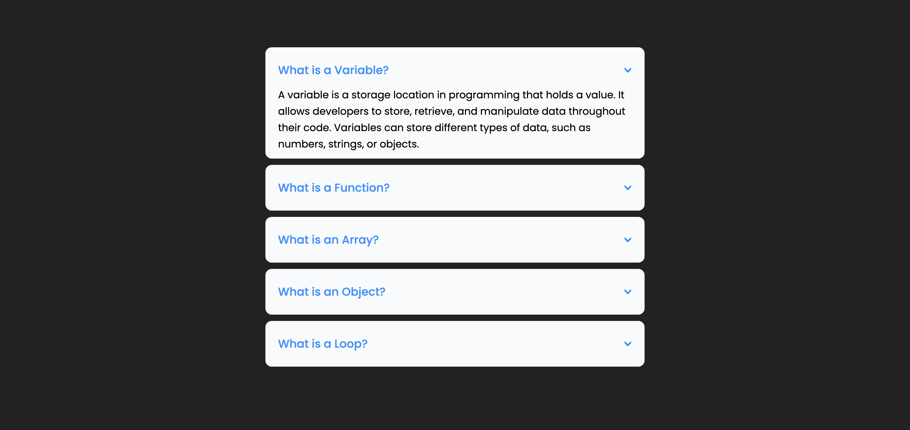

# Accordion

This is a simple accordion component created using HTML and CSS. The accordion allows users to expand and collapse sections to view related content. It is designed to be visually appealing and functional, making it suitable for displaying FAQs, definitions, or any other categorized information.

## Screenshots

## Demo
You can view the live demo of this project by clicking the link below:

https://skylaryhu.github.io/accordion-effect/
